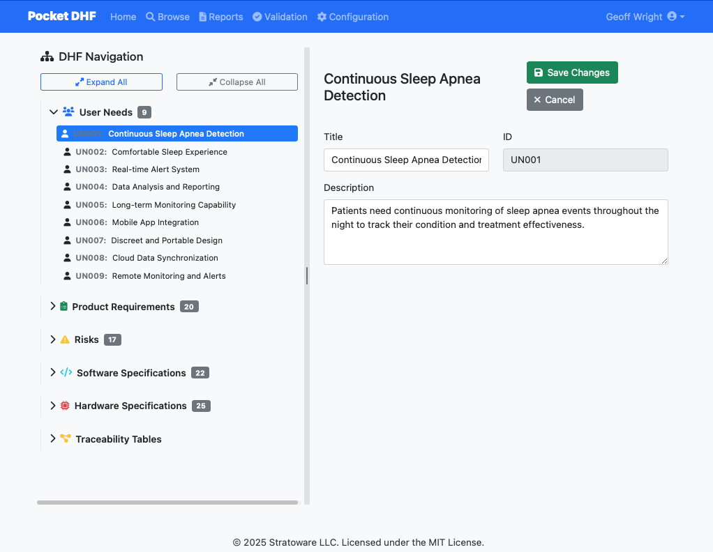

# Pocket DHF

[](LICENSE)
[](https://www.python.org/downloads/)
[](https://github.com/psf/black)

A lightweight, open-source Device History File (DHF) management system for medical device compliance.

## Description

Pocket DHF provides an efficient way to manage and track device history files for medical devices, ensuring compliance and streamlined documentation. Built for medical device manufacturers, quality engineers, and regulatory professionals, this system is designed to be lightweight, fast, and user-friendly while maintaining the necessary regulatory compliance features.

Unlike heavy enterprise document management systems, Pocket DHF uses simple YAML files for data storage, making it perfect for version control and team collaboration.

## ⚠️ Important Notice

**Regulatory Compliance Disclaimer**: Pocket DHF is a tool for managing Device History Files. Users are solely responsible for ensuring compliance with applicable regulations including FDA 21 CFR Part 820, ISO 13485, and other medical device standards. This software is provided "as-is" without warranty and does not guarantee regulatory compliance.

**Not a Medical Device**: This software is a documentation management tool and is not itself a medical device. It does not diagnose, treat, cure, or prevent any disease.

## Features

### 📋 Document Management
- Organize user needs, product requirements, design specifications, and risk assessments
- Three-level nested requirements structure for complex product hierarchies
- Folder-based organization with intuitive navigation
- Real-time editing with validation

### 🔗 Traceability
- Full bidirectional traceability matrix
- Link requirements to specifications to risks
- Visual traceability navigation with hyperlinks
- Automatic relationship tracking and validation

### 🎯 Risk Management
- ISO 14971 compliant risk assessment
- Risk-Benefit Matrix (RBM) calculations
- Link risks to mitigation strategies
- Configurable risk severity and probability scoring

### 📊 Reporting
- Generate comprehensive DHF reports
- Customizable report templates (Markdown-based)
- Export to HTML and PDF
- Auto-populated traceability matrices

### 🛠️ Developer-Friendly
- YAML-based data storage (version control friendly)
- RESTful API for integrations
- Modern web interface (Bootstrap 5)
- Lightweight - no database required
- Extensive test coverage (>80%)

## Screenshots

### Main Dashboard

*Browse and navigate your device history file structure*

### Requirements Editing

*Edit requirements with full traceability support*

### Traceability Matrix

*Visualize connections between user needs, requirements, and specifications*

### Risk Management

*Assess and manage risks per ISO 14971*

### Report Generation

*Generate regulatory-ready DHF reports*

## Quick Start

**Prerequisites:**
- Python 3.8 or higher
- Poetry (recommended) or pip

**Get started in 30 seconds:**

```bash
git clone https://github.com/stratoware/pocket-dhf.git
cd pocket-dhf
poetry install
poetry run python main.py
```

Then open http://localhost:8080 in your browser!

## Installation

### Option 1: Using Poetry (Recommended)

1. Clone the repository:
   ```bash
   git clone https://github.com/stratoware/pocket-dhf.git
   cd pocket-dhf
   ```

2. Install dependencies using Poetry:
   ```bash
   make install
   # or
   poetry install
   ```

### Option 2: Using pip

1. Clone the repository:
   ```bash
   git clone https://github.com/stratoware/pocket-dhf.git
   cd pocket-dhf
   ```

2. Create a virtual environment and install:
   ```bash
   python -m venv venv
   source venv/bin/activate  # On Windows: venv\Scripts\activate
   pip install -r requirements.txt  # Note: Generate from poetry if needed
   ```

## Running the Application

Start the development server:

```bash
poetry run python main.py
```

The application will be available at: http://localhost:8080

### Using Your Own Data File

To start with your own project data:

```bash
poetry run python main.py --data-file my-project.yaml
```

### Custom Port

```bash
poetry run python main.py --port 5000
```

## Usage

### First Time Setup

1. The app comes with sample data in `sample-data/dhf_data.yaml`
2. Explore the sample data to understand the structure
3. Create your own YAML file based on the sample
4. Start the app with your data file: `poetry run python main.py --data-file your-project.yaml`

### Basic Workflow

1. **Create User Needs**: Define what users need from your device
2. **Define Requirements**: Break down user needs into product requirements
3. **Specify Design**: Create software and hardware specifications
4. **Assess Risks**: Identify and evaluate risks per ISO 14971
5. **Link Everything**: Create traceability links between all elements
6. **Generate Reports**: Export your DHF for regulatory submissions

For detailed instructions, see the [User Guide](docs/user-guide.md).

## Documentation

- **[User Guide](docs/user-guide.md)** - How to use Pocket DHF
- **[Data Format Guide](docs/data-format.md)** - YAML schema and structure documentation
- **[Report Templates](sample-data/report-templates/)** - Customizing report generation

## Development

### Available Commands

- `make install` - Install dependencies using Poetry
- `make test` - Run tests with pytest
- `make lint` - Run linting with flake8
- `make format` - Format code with black and isort
- `make copyright-check` - Check for missing copyright headers
- `make copyright-fix` - Automatically add missing copyright headers
- `make docstring-check` - Check for missing class docstrings
- `make docstring-fix` - Automatically add missing class docstrings
- `make pre-commit-install` - Install pre-commit hooks
- `make clean` - Clean up temporary files

### Code Quality

This project uses several tools to maintain code quality:

- **Black**: Code formatting
- **isort**: Import sorting
- **flake8**: Linting
- **pytest**: Testing with coverage (>80% required)
- **pre-commit**: Git hooks for quality checks

### Running Tests

```bash
make test
# or
poetry run pytest
```

View coverage report: `open htmlcov/index.html`

## Project Structure

```
pocket-dhf/
├── app/                    # Main application package
│   ├── __init__.py        # Flask app factory
│   ├── routes.py          # Application routes
│   ├── data_utils.py      # Data management utilities
│   ├── templates/         # Jinja2 templates
│   └── static/            # Static files (CSS, JS, images)
├── tests/                 # Test files
│   ├── unit/             # Unit tests
│   └── integration/      # Integration tests
├── scripts/               # Utility scripts
├── sample-data/          # Sample DHF data
│   └── report-templates/ # Report templates
├── docs/                 # Documentation
│   └── images/          # Screenshots
├── main.py               # Application entry point
├── pyproject.toml        # Poetry configuration
└── README.md             # This file
```

## Contributing

We welcome contributions! Please see [CONTRIBUTING.md](CONTRIBUTING.md) for details on:
- How to set up the development environment
- Our code style guidelines
- How to submit pull requests
- Our code of conduct

**Quick Start for Contributors:**

```bash
# Fork the repo, then:
git clone https://github.com/YOUR-USERNAME/pocket-dhf.git
cd pocket-dhf
make install
make test
make format
```

## Support

- 📖 **Documentation**: See [docs/](docs/)
- 🐛 **Bug Reports**: [GitHub Issues](https://github.com/stratoware/pocket-dhf/issues)
- 💡 **Feature Requests**: [GitHub Discussions](https://github.com/stratoware/pocket-dhf/discussions)
- 💬 **Questions**: [GitHub Discussions Q&A](https://github.com/stratoware/pocket-dhf/discussions/categories/q-a)

## License

This project is licensed under the MIT License - see the [LICENSE](LICENSE) file for details.

### Why MIT?

We chose the MIT License to maximize adoption and allow both open-source and commercial use. You're free to use Pocket DHF in your commercial products, fork it, modify it, and distribute it as you see fit - just retain the copyright notice.

**Copyright (c) 2025 Stratoware LLC**

---

*Built with ❤️ for the medical device community*
