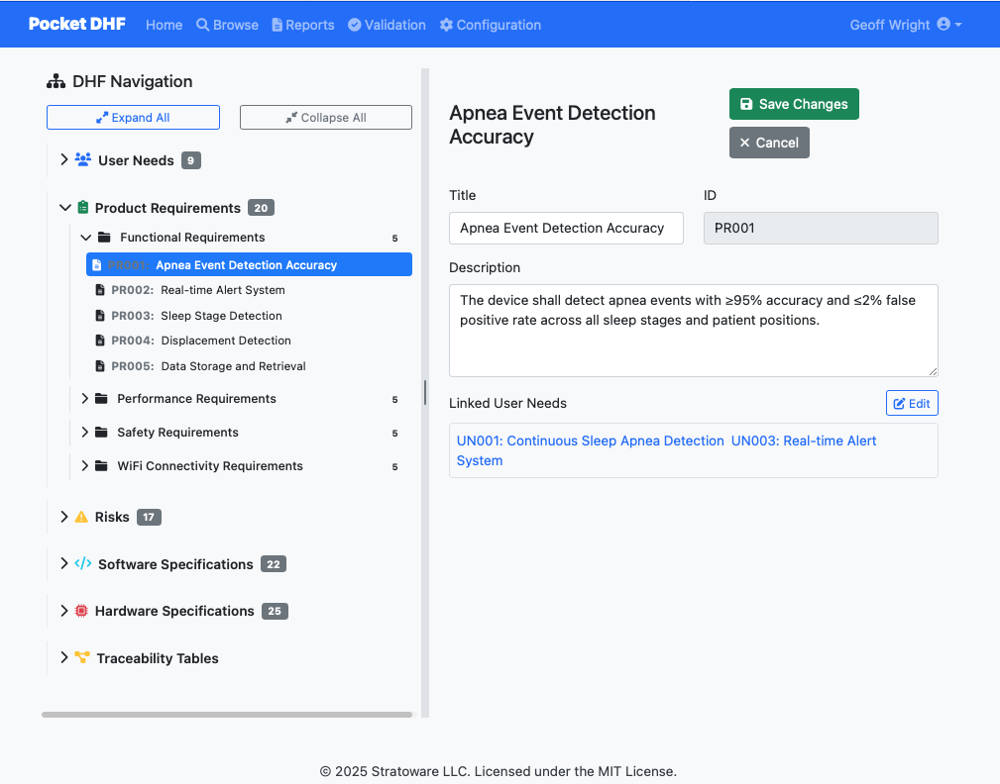
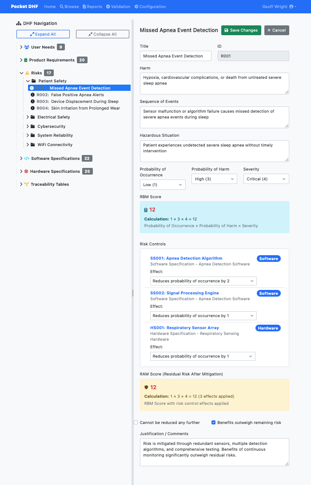
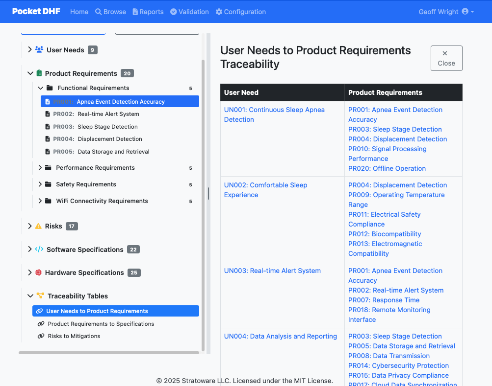

# Pocket DHF User Guide

A comprehensive guide to using Pocket DHF for managing your Device History File.

## Table of Contents

- [Getting Started](#getting-started)
- [Understanding the Interface](#understanding-the-interface)
- [Managing User Needs](#managing-user-needs)
- [Working with Requirements](#working-with-requirements)
- [Creating Specifications](#creating-specifications)
- [Risk Management](#risk-management)
- [Traceability](#traceability)
- [Generating Reports](#generating-reports)
- [Configuration](#configuration)
- [Best Practices](#best-practices)

## Getting Started

### First Launch

When you first launch Pocket DHF, it loads with sample data to help you understand the structure:

```bash
poetry run python main.py
```

Navigate to http://localhost:8080 to see the application.

### Creating Your Own Project

1. Create a new YAML file for your project:
   ```bash
   cp sample-data/dhf_data.yaml my-project.yaml
   ```

2. Launch with your project file:
   ```bash
   poetry run python main.py --data-file my-project.yaml
   ```

3. Edit the metadata section to reflect your device information

## Understanding the Interface


### Navigation Bar

- **Home**: Dashboard and quick links
- **Browse**: Navigate and edit your DHF content
- **Reports**: Generate regulatory reports
- **Validation**: System validation documentation
- **Configuration**: Manage risk scoring and configurations

### Browse Page

The Browse page is your main workspace:

- **Left Sidebar**: Tree view of your DHF structure
  - User Needs
  - Product Requirements (up to 3 levels)
  - Software Specifications
  - Hardware Specifications
  - Risks

- **Center Panel**: Details of selected item
  - Edit fields
  - Linked items
  - Save/Cancel buttons

- **Traceability View**: Visual matrix of relationships

## Managing User Needs

User Needs represent what your users want from the device.

### Creating a User Need

1. Navigate to Browse
2. Click on "User Needs" folder in sidebar
3. Click "Add User Need" button
4. Fill in the form:
   - **ID**: Unique identifier (e.g., UN001)
   - **Title**: Descriptive title
   - **Description**: Detailed description of the need

### Editing User Needs

1. Click on a user need in the sidebar
2. Edit fields in the center panel
3. Click "Save Changes"

### Best Practices

- Use clear, user-centric language
- One need per entry (don't combine multiple needs)
- Reference user research or stakeholder input
- Number sequentially (UN001, UN002, etc.)

## Working with Requirements

Product Requirements define how your device will meet user needs.



### Requirement Hierarchy

Pocket DHF supports up to 3 levels of requirements:

1. **Level 1**: Top-level product requirements (PR001)
2. **Level 2**: Sub-requirements (PR001.1)
3. **Level 3**: Detailed requirements (PR001.1.1)

### Creating Requirements

1. Navigate to "Product Requirements" in sidebar
2. Click "Add Requirement" or "Add Sub-Requirement"
3. Fill in:
   - **ID**: Follow hierarchical naming (PR001, PR001.1, etc.)
   - **Title**: Clear, concise title
   - **Description**: Detailed description
   - **Verification Method**: How you'll verify this requirement
   - **Linked User Needs**: Which user needs this addresses

### Linking to User Needs

Creating traceability links:

1. Open a requirement
2. Scroll to "Linked Items" section
3. Click "Edit Links"
4. Check the user needs this requirement addresses
5. Click "Save Changes"

## Creating Specifications

Specifications define the technical implementation.

### Software Specifications

1. Navigate to "Software Specifications"
2. Click "Add Specification"
3. Fill in details including:
   - Module/component information
   - Technical details
   - Linked requirements

### Hardware Specifications

Similar process for hardware components:

1. Navigate to "Hardware Specifications"
2. Create specs for each hardware component
3. Link back to requirements they implement

## Risk Management



Pocket DHF supports ISO 14971 risk management.

### Creating a Risk

1. Navigate to "Risks" folder
2. Click "Add Risk"
3. Fill in:
   - **ID**: Risk identifier (R001, R002, etc.)
   - **Title**: Brief description of the hazard
   - **Description**: Detailed hazard scenario
   - **Severity**: Select from configured levels (S1-S9)
   - **Probability of Occurrence**: PO1-PO3
   - **Probability of Harm**: PH1-PH3

### Risk-Benefit Matrix (RBM)

The RBM score is calculated automatically:

```
RBM = Severity × Probability of Occurrence × Probability of Harm
```

### Mitigation Strategies

1. Open a risk
2. In "Linked Items", link to specifications that mitigate this risk
3. Document how each specification reduces the risk
4. Update severity/probability to reflect post-mitigation levels

### Risk Acceptability

Configure risk acceptability thresholds in Configuration page.

## Traceability



### Understanding Traceability

Pocket DHF maintains bidirectional traceability:

- User Needs → Product Requirements
- Product Requirements → Specifications
- Specifications → Risks (mitigations)

### Viewing Traceability

Multiple ways to view traceability:

1. **In-line Links**: Click on linked items when editing
2. **Traceability View**: Click "Show Traceability" button
3. **Reports**: Generate full traceability matrices

### Ensuring Complete Traceability

Check for:
- All user needs have at least one requirement
- All requirements have specifications
- All high-priority requirements link to tests
- All identified risks have mitigations

## Generating Reports


### Available Reports

Pocket DHF comes with several report templates:

1. **Requirements and Needs**: Full requirements documentation
2. **Risk Management Report**: ISO 14971 compliant risk report
3. **Specifications Report**: Technical design documentation
4. **Traceability Matrix**: Complete traceability documentation

### Generating a Report

1. Navigate to Reports page
2. Select a report template
3. Click "Generate"
4. View in browser or export to PDF

### Customizing Reports

Report templates are in `sample-data/report-templates/` as Markdown files.

1. Copy an existing template
2. Edit the Markdown
3. Use `{{placeholders}}` for auto-populated content
4. Save and refresh reports page

See [Report Templates README](../sample-data/report-templates/README.md) for details.

## Configuration

### Risk Scoring

Configure how risks are scored:

1. Navigate to Configuration page
2. Edit severity levels (S1-S9)
3. Edit probability mappings (PO1-PO3, PH1-PH3)
4. Save changes

### Custom Fields

*Coming soon*

## Best Practices

### Organizational

- **Version Control**: Store your YAML file in Git
- **Backups**: Regular backups of your DHF data
- **Review Cycle**: Regular reviews of requirements and risks
- **Team Collaboration**: Use pull requests for changes

### Writing Requirements

- Use "shall" for mandatory requirements
- One requirement per entry
- Make requirements testable/verifiable
- Include acceptance criteria

### Risk Management

- Review risks when requirements change
- Update post-mitigation severity/probability
- Document risk acceptability rationale
- Keep risk assessments current

### Traceability

- Link as you go (don't wait until the end)
- Verify all links are meaningful
- Check for orphaned requirements
- Use traceability reports to find gaps

## Keyboard Shortcuts

*Coming soon*

## Troubleshooting

### Application Won't Start

- Check Python version (3.8+)
- Verify Poetry installation
- Check for port conflicts (default 8080)

### Data Not Saving

- Check file permissions on your YAML file
- Verify YAML syntax (use `make test`)
- Check console for errors

### Links Not Working

- Verify ID references match exactly
- Check for duplicate IDs
- Ensure items exist before linking

## Getting Help

- 📖 See [Data Format Guide](data-format.md) for YAML structure
- 🐛 Report bugs: [GitHub Issues](https://github.com/stratoware/pocket-dhf/issues)
- 💬 Ask questions: [GitHub Discussions](https://github.com/stratoware/pocket-dhf/discussions)

---

*For technical details about the YAML data format, see [Data Format Guide](data-format.md)*
